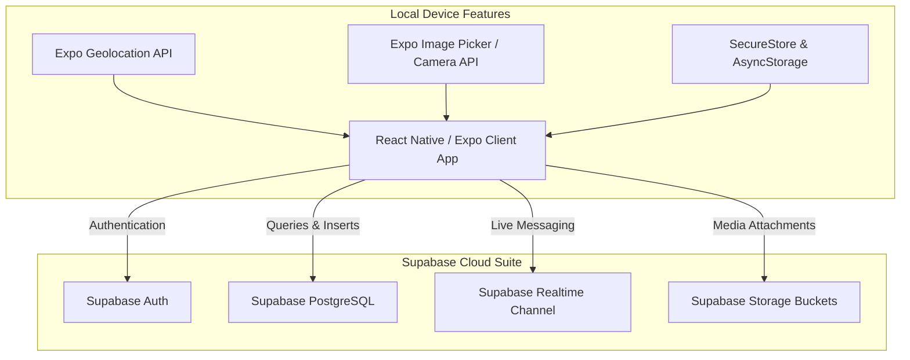
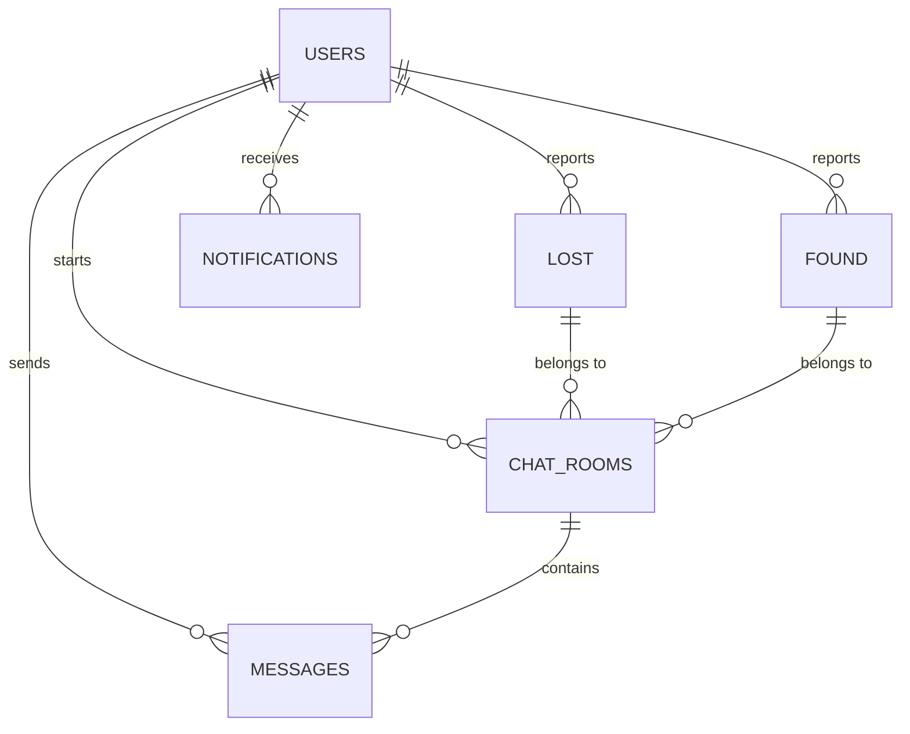

# 📱 ClaimIt - Premium Lost & Found Mobile Application

ClaimIt is a modern, full-featured, and visually stunning cross-platform mobile application designed to bridge the gap between people who have lost items and the good Samaritans who find them. Built on a cutting-edge mobile architecture combining **React Native**, **Expo Router (v6)**, and **Supabase (PostgreSQL + Realtime)**, ClaimIt provides an intuitive, instant, and secure hub for community recovery.

---

## 📖 Table of Contents
1. [🌟 Key Features](#-key-features)
2. [📐 System Architecture](#-system-architecture)
3. [🛠️ Tech Stack](#️-tech-stack)
4. [📂 Directory Structure](#-directory-structure)
5. [🗄️ Database & Backend Architecture](#️-database--backend-architecture)
6. [🚀 Quick Start & Installation](#-quick-start--installation)
7. [📘 Comprehensive User Manual](#-comprehensive-user-manual)
8. [🛡️ Security, Privacy & RLS Policies](#️-security-privacy--rls-policies)
9. [🔧 Troubleshooting Guide](#-troubleshooting-guide)
10. [🔮 Future Roadmap](#-future-roadmap)
11. [📞 Support & Contact](#-support--contact)

---

## 🌟 Key Features

ClaimIt is packed with premium features designed to streamline the recovery process:

*   **🔒 Secure & Smooth Authentication**: Secure sign-up/login system using Supabase Auth with custom animated interfaces.
*   **📋 Dynamic Dashboard**: Search, filter by category, and easily toggle between comprehensive lists and map view systems.
*   **📍 Precision Location Mapping**: Integrates with interactive maps (`react-native-maps` / `expo-location`) to select exact coordinates where items were misplaced or retrieved.
*   **📷 Photo & Media Uploads**: Integrated camera and camera-roll picker (`expo-image-picker`) enabling users to attach high-quality visual proof to their listings.
*   **⚡ Intelligent Matching & Notifications**: Built-in real-time notification engine that flags potential matches based on category, titles, and locations.
*   **💬 Real-Time In-App Chat**: Interactive direct messaging workspace between owners and finders powered by Supabase Realtime Channels.
*   **🤝 Trust, Ratings & Review System**: Profile integration allowing users to earn ratings and badges to promote community trust.
*   **🎧 Integrated Chat Support**: Direct, dedicated support desk window to get system-wide help from admins instantly.
*   **🛡️ Complete Privacy & Security Hub**: Transparent data handling practices and detailed guidelines so users protect their personal details during recovery.

---

## 📐 System Architecture

ClaimIt follows a robust three-tier serverless mobile architecture:



---

## 🛠️ Tech Stack

*   **Frontend Mobile Framework**: React Native (v0.81.5) with [Expo (SDK 54)](https://expo.dev/)
*   **Navigation**: Expo Router (v6) - file-based, deep-linkable router
*   **Backend-as-a-Service**: [Supabase](https://supabase.com/)
    *   **Postgres Database**: Relational schema with index optimization
    *   **Realtime Engine**: WebSocket connection for instantaneous chat updates
    *   **Row-Level Security (RLS)**: Fine-grained security access control
*   **Styling & Theming**: Premium Dark-Theme Gradients utilizing `expo-linear-gradient`
*   **Maps & Location**: `react-native-maps` & `expo-location`
*   **Language**: TypeScript (v5.9) with strict type-safety enforcement

---

## 📂 Directory Structure

Here is a map of the ClaimIt project files:

```text
claimit/
├── .expo/                   # Expo local configuration and cache files
├── android/                 # Auto-generated Native Android project files
├── assets/                  # App assets including images, icons, and fonts
├── app/                     # Expo Router Navigation Core (Root entry point)
│   ├── (screens)/           # Tab and details router screens
│   │   ├── privacy-security.tsx
│   │   ├── profile.tsx
│   │   ├── working.tsx
│   │   ├── lost.tsx
│   │   ├── found.tsx
│   │   └── chat.tsx
│   ├── chat/                # Nested chat routes
│   ├── _layout.tsx          # App base configuration & navigation tree
│   ├── chat.tsx             # Root chat entry screen
│   ├── index.tsx            # Initial landing logic (Auth redirection)
│   └── notification.tsx     # System Notifications screen
├── screens/                 # Core Screen Component Implementations
│   ├── SignInSignUpPage.tsx # Animated Authentication screen
│   ├── HomePage.tsx         # Dashboard with lost/found items feed
│   ├── Lost.tsx             # Multi-step lost report wizard
│   ├── Found.tsx            # Structured found report wizard
│   ├── Notification.tsx     # Real-time notifications and matches hub
│   ├── ChatRoom.tsx         # Active workspace for live chats
│   ├── ChatSupport.tsx      # Admin-support direct line
│   ├── Profile.tsx          # User profile card & review display
│   ├── EditProfile.tsx      # User detail customization form
│   ├── PrivacySecurity.tsx  # Terms of service and privacy layout
│   ├── Working.tsx          # Interactive "How It Works" guide
│   └── index.ts             # Direct Screen exports index
├── lib/                     # Client libraries and adapters
│   ├── supabase.ts          # Core Supabase Client setup with SecureStore
│   └── supabaseClient.js    # Auxiliary Supabase JS adapter
├── setup_database.sql       # PostgreSQL DB schema, triggers, and RLS policies
├── clean_public.sql         # SQL script to purge or structure public domains
├── package.json             # NPM dependencies & operational run scripts
└── tsconfig.json            # Configuration options for TypeScript compilation
```

---

## 🗄️ Database & Backend Architecture

The backend of ClaimIt runs completely on Postgres within Supabase. The database contains optimal structures for fast lookups, automated triggers, and airtight policies.

### 📊 Database Schema Relationships



### 🧱 Core Tables
1.  **`public.lost`**: Tracks all user-reported lost items.
    *   `id` (UUID, Primary Key)
    *   `user_id` (UUID, references `auth.users`)
    *   `item_name` (Text, Name of the lost object)
    *   `category` (Text, Category filtering)
    *   `description` (Text, Specific item details)
    *   `date_lost` (Date, Calendar date of loss)
    *   `contact_details` (Text, Personal fallback contact info)
    *   `location` (JSONB, coordinates & place naming details)
    *   `status` (Text, either `active`, `found`, or `closed`)
2.  **`public.found`**: Stores details of recovered items reported by finders.
    *   `id` (UUID, Primary Key)
    *   `user_id` (UUID, references `auth.users`)
    *   `item_name`, `category`, `description`, `date_found`
    *   `location` (JSON, mapping information)
    *   `contact_details`, `status`
3.  **`public.chat_rooms`**: Binds unique lost and found listings together for peer communication.
    *   `id` (UUID, Primary Key)
    *   `lost_user_id` / `found_user_id` (UUID references to `auth.users`)
    *   `lost_item_id` / `found_item_id` (UUID references to `lost` / `found` tables)
4.  **`public.messages`**: Real-time message exchanges.
    *   `id` (UUID, Primary Key)
    *   `chat_room_id` (UUID references `chat_rooms`)
    *   `sender_id` (UUID references `auth.users`)
    *   `content` (Text body of message)
    *   `type` (Text: default `'text'`)
5.  **`public.notifications`**: Tracks potential matches, chat requests, and announcements.
    *   `user_id` (UUID references `auth.users`)
    *   `type`, `title`, `message` (Content details)
    *   `related_items` (JSONB containing `lost_item_id` / `found_item_id`)
    *   `read` (Boolean tracker)

---

## 🚀 Quick Start & Installation

To run ClaimIt locally on your machine, follow these step-by-step instructions:

### 📋 Prerequisites
*   [Node.js](https://nodejs.org/) (v18 or higher recommended)
*   [Git](https://git-scm.com/) installed
*   [Expo Go](https://expo.dev/client) app installed on your physical iOS/Android device **OR** local Android Studio Emulator / Xcode Simulator.
*   A [Supabase](https://supabase.com/) Account (Free tier works perfectly).

### 🛠️ 1. Clone & Install dependencies
```bash
# Clone the repository
git clone https://github.com/your-username/claimit.git
cd claimit

# Install package dependencies
npm install
```

### 🗄️ 2. Supabase Backend Initialization
1.  Go to the [Supabase Dashboard](https://supabase.com/dashboard) and create a **New Project**.
2.  Once your project is created, navigate to the **SQL Editor** in the left sidebar.
3.  Click **New Query**, copy the entire contents of [setup_database.sql](file:///c:/Users/ashpu/OneDrive/Desktop/Repos/Claimitcloned/claimit/setup_database.sql), paste it into the editor, and click **Run**.
    > [!IMPORTANT]
    > This SQL script creates the necessary Postgres tables, enables Row Level Security (RLS), adds the automatic timestamps trigger, builds high-performance indexes, configures specific permissions, and registers the messages table with the Realtime publication.

### 🔑 3. Configure Environment Variables
Create a file named `.env` in the root of the project:
```env
EXPO_PUBLIC_SUPABASE_URL=https://your-project-ref.supabase.co
EXPO_PUBLIC_SUPABASE_ANON_KEY=your-supabase-anon-key-here
```
*(Replace `your-project-ref` and the key with the actual credentials found in your **Project Settings > API** tab of the Supabase dashboard).*

### 📱 4. Launching the App
Now start the Metro bundler to run the application:
```bash
# Start the Metro bundler
npm run start
```
From the interactive command-line menu:
*   Press **`a`** to open in an **Android** emulator.
*   Press **`i`** to open in an **iOS** simulator.
*   Press **`w`** to open the **web browser** client version.
*   Scan the generated **QR Code** using your **Expo Go** mobile app (on Android) or your default Camera app (on iOS) to launch the app on your physical device.

---

## 📘 Comprehensive User Manual

Welcome to the ClaimIt community! Follow this manual to master the application and successfully recover or return items.

```text
  ClaimIt User Journey Workflow:
  [ Register/Login ] ──> [ Home Dashboard ]
                             │
            ┌────────────────┴────────────────┐
            ▼                                 ▼
    [ Report Lost Item ]              [ Report Found Item ]
            │                                 │
            └───────────────┬─────────────────┘
                            ▼
           [ Algorithm Search & Matches ]
                            │
                            ▼
            [ Live Chat with Peer / Match ]
                            │
                            ▼
                [ Item Recovered & Closed ]
```

### 👤 Step 1: Authentication & Profile Setup
*   **Creating an Account**: Launch the application. On the login screen, switch to the "Sign Up" panel. Input your email address and secure password. Click register.
*   **Customizing Your Profile**: Once logged in, navigate to the **Profile** tab. Click the edit icon to configure your display name, upload a custom avatar image, and update personal details.
*   **Verification Status**: Check your trust score dashboard. Building a stellar profile with completed recoveries boosts your credibility score, shown as a premium star rating system.

### 🔍 Step 2: Navigating the Dashboard
*   **Live Feeds**: The dashboard dynamically streams lost and found items in separate, highly visual modules.
*   **Search**: Tap the search bar and type in keyword matches (e.g., "iPhone", "Brown Wallet").
*   **Filters**: Quickly filter the database feed by choosing specific categories (Electronics, Keys, Pets, Documents, Bags, etc.).
*   **Map/Grid View**: Toggle between list displays and an interactive Map View pinpointing recent incidents.

### 📍 Step 3: Reporting a Lost Item
If you have lost an item, follow these steps to alert the network:
1.  Navigate to the **Report Lost** section (represented by the red search icon).
2.  **Item Details**: Provide a clear, descriptive title and choose the most accurate Category.
3.  **The Details**: In the description box, outline any unique identifying marks, serial numbers, color shades, or status conditions.
4.  **Date Misplaced**: Tap the date selector to mark the calendar date the item was lost.
5.  **Pinpoint Location**: Use the integrated Map screen to place a marker at the exact location the item was last seen.
6.  **Add Images**: Snap a live picture or select pictures from your phone gallery showing the item.
7.  **Contact Info**: Input your preferred fallback contact details.
8.  **Submit**: Review and submit. Your listing is instantly active across the network!

### 🤝 Step 4: Reporting a Found Item
Help someone's day by reporting a found item:
1.  Navigate to the **Report Found** section (teal circular icon).
2.  Provide description details, approximate discovery date, and upload a picture.
    > [!TIP]
    > To prevent fraudulent claims, do not disclose highly specific identifying features (e.g., specific lock screen wallpaper, secondary hidden contents). Keep those details secret, and ask potential owners to identify them during your chat!
3.  Mark where you found the object on the interactive map so local search engines match it with the owner's lost report.
4.  Specify where the item is currently kept (e.g., "Left at local cafe counter", "Safe in my possession").

### 💬 Step 5: Connecting, Chatting & Recovery
*   **Automatic Matching**: When a lost item matches a found item's location and category, both users receive a high-priority system **Notification** containing direct links to both listings.
*   **Opening a Chat**: Tap on the matching notification or item post, then select **Send Message**. This opens a private **Chat Room** instantly.
*   **Secure Real-time Messaging**: Discuss details in real-time. Share locations, ask matching security questions to confirm ownership, and coordinate a safe meeting place.
*   **Closing the Case**: Once the owner successfully claims the item, mark the report status as **Closed/Recovered**. This updates the case status, triggers positive community feedback, and increases your personal trust score!

---

## 🛡️ Security, Privacy & RLS Policies

To guarantee absolute security and protect user data from unauthorized access or malicious web crawlers, ClaimIt utilizes PostgreSQL **Row Level Security (RLS)** policies on all tables.

### 🛡️ RLS Security Matrix

| Table Name | `SELECT` Operations | `INSERT` Operations | `UPDATE` Operations | `DELETE` Operations |
| :--- | :--- | :--- | :--- | :--- |
| **`public.lost`** | Authenticated users only | Must match authenticated `user_id` | `auth.uid() = user_id` only | `auth.uid() = user_id` only |
| **`public.found`** | Open to all users | Authenticated users only | `auth.uid() = user_id` only | `auth.uid() = user_id` only |
| **`public.chat_rooms`** | Participant users only | Authenticated users only | None (Immutable) | None (Immutable) |
| **`public.messages`** | Chat room participants only | Chat room participants only | None (Immutable) | Message author (`sender_id`) |
| **`public.notifications`**| Targeted user only | Authenticated users only | Targeted user only | Targeted user only |

---

## 🔧 Troubleshooting Guide

Here is how to resolve the most common issues when configuring or running ClaimIt:

### 🔴 Supabase Network Connection / Auth Failures
*   **Symptom**: Unable to register users or login. Client outputs connection timeouts.
*   **Solution**: Check your `.env` file structure. React Native requires environment variables to be prefixed with `EXPO_PUBLIC_` to load them correctly into the bundle (e.g., `EXPO_PUBLIC_SUPABASE_URL`). Restart Metro with `npm run start -- --clear` to clear cache.

### 📍 Location Service Errors
*   **Symptom**: The map view does not focus, or location updates fail.
*   **Solution**: Check permissions. ClaimIt requests coarse/fine permissions. Go to your phone's developer Settings > Apps > ClaimIt > Permissions and ensure location access is toggled **On**. Ensure your physical device has Location/GPS active.

### 🔔 Notifications Not Updating
*   **Symptom**: New items don't appear in the notifications page.
*   **Solution**: Ensure that your Supabase project has the realtime engine active on the tables. Execute the bottom section of `setup_database.sql` to explicitly add the target tables to the `supabase_realtime` publication.

---

## 🔮 Future Roadmap

*   [ ] **🧠 AI Image Matching**: Automate match searches using neural networks (like Gemini Vision API) to compare uploaded lost photos with found photos and flag matches immediately.
*   [ ] **🗺️ Proximity-Based Alerts**: Send push notifications to nearby users who have consented to local alerts when a highly valuable item is reported lost nearby.
*   [ ] **📎 Smart Labels (QR Codes)**: Print unique, generated ClaimIt QR labels to stick onto keys, laptops, or pet collars for fast scanning and recovery.
*   [ ] **🔐 Reward Payments System**: Integrated escrow service allowing owners to safely reward good Samaritans who successfully return items.

---

## 📞 Support & Contact

If you experience any operational difficulties, navigate to the **Support** screen inside the app's settings panel for direct chat assistance, or reach out to us:

*   📧 **Official Support**: support@claimit.com
*   💻 **Developer contact**: Ashbin (Creator)

---

*Made with ❤️ by Ashbin to foster supportive communities everywhere.*
